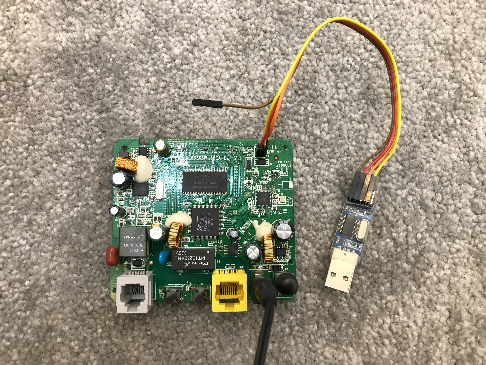
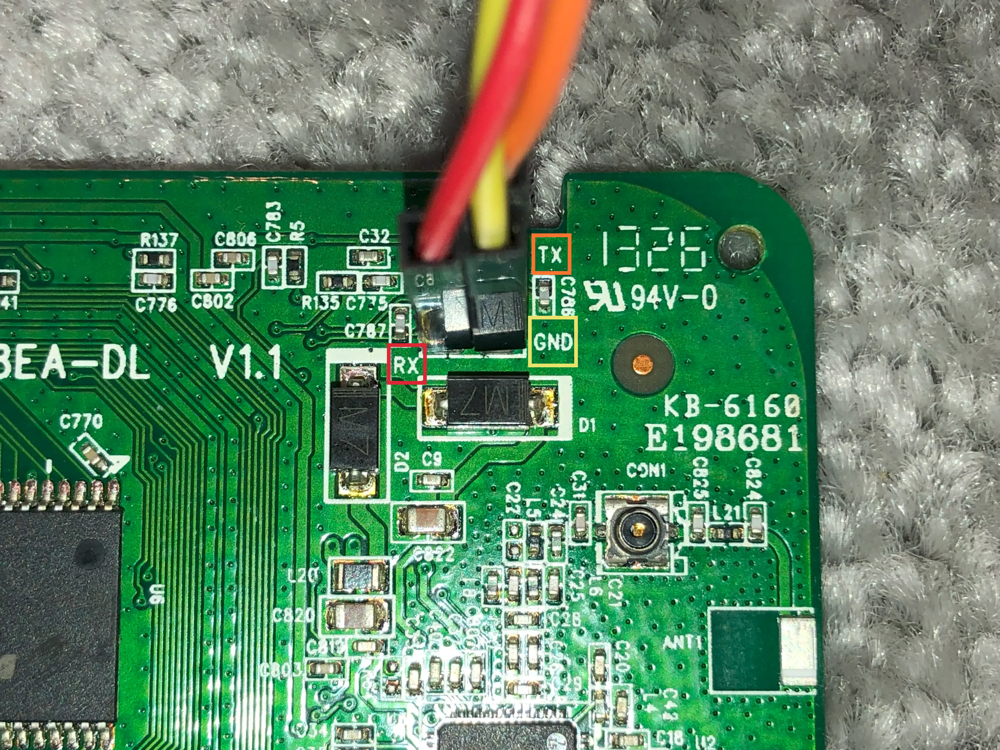

---
id: 4
date: 2024-04-23T20:40:00Z
title: Debricking D-Link DSL-2600U router (Z2 hardware variant)
description: The instruction to debrick the D-Link DSL-2600U ADSL2+ wireless router without unsoldering the flash chipset.
banner: banner.webp
tags:
  - Router
  - Debrick
  - D-Link
...

The D-Link DSL-2600U model has different hardware variants (e.g. Z1 and Z2). If you downloaded the wrong firmware variant from the D-Link support website and updated your router and the router won't boot anymore, it's possible to bring this old router once again to life.

## Preparation

You need a USB to Serial adapter (mine is [Prolific PL2303](https://www.prolific.com.tw/US/ShowProduct.aspx?pcid=41)). Open the router case and connect the `GND` adapter's pin to the `GND` port on the router's board, `Tx` to the `Rx` and `Rx` to the `Tx`.




## Setting up the environment

Make sure that you've installed the adapter drivers and connected the adapter to your system's USB port. Download [TeraTerm](https://github.com/TeraTermProject/teraterm) and run it. In the application, open a new serial connection to the router, and from the `Setup > Serial Port` menu, change the "Baud rate / Speed" to 115200.  
You should see the following output on the console when turning the router on.

```
Bootbase Version: VTC_SPI1.26 |  2012/12/26 16:00:00
RAM: Size = 16384 Kbytes
Found SPI Flash 2MiB Winbond W25Q16 at 0xbfc00000
```

## Flashing the chipset

Turn off the router, press and hold the reset button and then press the power button to turn the device on. If you see the following output on the console, you've successfully booted into the SoC bootloader.

```
RT63365 at Tue May 8 19:47:16 CST 2012 version 0.8

Memory size 16MB

HWCONF=04005d00
DRAM Mode=00000000
MCC1=00000000

Search PHY addr and found PHY addr=0
done
```

On the console, press the `x` key and from the `File > Transfer > XMODEM > Send...` menu, send the [recovery.img](recovery.img) file to the router. The router will reboot to the recovery image after the upload process is done.

```
done
CCreceived len=0000bb00
jump to 80008000 len=00000000


RT63365 at Thu Apr 2 18:14:49 MSK 2015 version 1.1

Memory size 16MB

flash base: b0000000
Found SPI Flash 2MiB Winbond W25Q16 at 0xb0000000

cmd >
```

You can type `help` to see the available commands.  
Now it's time to rewrite the flash chip. Type the `xmdm 80300000 200000` command and hit enter. After that, from the `File > Transfer > XMODEM > Send...` menu, upload the [flash.bin](flash.bin) (firmware version is 1.08 and it's for the Z2 variant—I don't have the Z1 variant) file to the router volatile memory.

```
cmd > xmdm 80300000 200000
CCCreceived len=200000
```

Then, you can write the uploaded flash file with the `flash 0 80300000 200000` command to the chipset.

```
cmd > flash 0 80300000 200000
Write to flash from 80300000 to 0 with 200000 bytes
erase addr=0 size=10000
erase addr=10000 size=10000
erase addr=20000 size=10000
erase addr=30000 size=10000
erase addr=40000 size=10000
erase addr=50000 size=10000
erase addr=60000 size=10000
erase addr=70000 size=10000
erase addr=80000 size=10000
erase addr=90000 size=10000
erase addr=a0000 size=10000
erase addr=b0000 size=10000
erase addr=c0000 size=10000
erase addr=d0000 size=10000
erase addr=e0000 size=10000
erase addr=f0000 size=10000
erase addr=100000 size=10000
erase addr=110000 size=10000
erase addr=120000 size=10000
erase addr=130000 size=10000
erase addr=140000 size=10000
erase addr=150000 size=10000
erase addr=160000 size=10000
erase addr=170000 size=10000
erase addr=180000 size=10000
erase addr=190000 size=10000
erase addr=1a0000 size=10000
erase addr=1b0000 size=10000
erase addr=1c0000 size=10000
erase addr=1d0000 size=10000
erase addr=1e0000 size=10000
erase addr=1f0000 size=10000

program from 0 to 200000
................................................................
```

All done! Just reboot the router, and now you should see the complete bootlog on the console.

```
Bootbase Version: VTC_SPI1.26 |  2012/12/26 16:00:00
RAM: Size = 16384 Kbytes
Found SPI Flash 2MiB Winbond W25Q16 at 0xbfc00000
SPI Flash Quad Enable
Turn off Quad Mode

RAS Version: v1.08
System   ID: $2.12.108.1(G04.BZ.4)3.20.21.0| 2013/11/28   20131128_v003  | 2013/11/28

Press any key to enter debug mode within 3 seconds.
...........
```

> **Warning**  
> The previous stored configurations on the router should be cleared. To do that, plug the LAN cable into the router, head to the http://192.168.1.1 page, and reset the configurations to the factory defaults.

<br/>

> **Note**  
> You can view the debug console help menu with the `ATHE` command.
>
> ```
> ATHE
> ======= Debug Command Listing =======
> AT          just answer OK
> ATHE          print help
> ATBAx         change baudrate. 1:38.4k, 2:19.2k, 3:9.6k 4:57.6k 5:115.2k
> ATENx,(y)     set BootExtension Debug Flag (y=password)
> ATSE          show the seed of password generator
> ATTI(h,m,s)   change system time to hour:min:sec or show current time
> ATDA(y,m,d)   change system date to year/month/day or show current date
> ATDS          dump RAS stack
> ATDT          dump Boot Module Common Area
> ATDUx,y       dump memory contents from address x for length y
> ATRBx         display the  8-bit value of address x
> ATRWx         display the 16-bit value of address x
> ATRLx         display the 32-bit value of address x
> ATGO(x)       run program at addr x or boot router
> ATGR          boot router
> ATGT          run Hardware Test Program
> ATRTw,x,y(,z) RAM test level w, from address x to y (z iterations)
> ATSH          dump manufacturer related data in ROM
> ATDOx,y       download from address x for length y to PC via XMODEM
> ATTD          download router configuration to PC via XMODEM
> ATUR          upload router firmware to flash ROM
>
> < press any key to continue >
> ATLC          upload router configuration file to flash ROM
> ATXSx         xmodem select: x=0: CRC mode(default); x=1: checksum mode
> ATLD          Upload Configuration File and Default ROM File to Flash
> ATCD          Convert Running ROM File to Default ROM File into Flash
>
> OK
> ```
